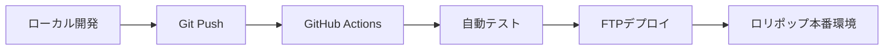

# ロリポップ運用ガイド

## GitHub連携とFTP自動デプロイ設定

### 1. GitHub Secretsの設定

GitHubリポジトリの「Settings」→「Secrets and variables」→「Actions」で以下を設定：

```
FTP_SERVER: ftp.lolipop.jp
FTP_USERNAME: your_lolipop_account
FTP_PASSWORD: your_ftp_password
```

### 2. ロリポップでの初期設定

#### データベース作成
1. ロリポップの管理画面でMySQLデータベースを作成
2. データベース名例: `LAA0123456-quiztool`
3. `sql/schema_lolipop.sql` をphpMyAdminで実行

#### .envファイルの設定
```bash
DB_HOST=mysql-XX.lolipop.jp
DB_NAME=LAA0123456-quiztool  
DB_USER=LAA0123456
DB_PASS=your_database_password
```

#### .htaccessの設定
- `.htaccess.lolipop` を `.htaccess` にリネーム
- PHP8.1を使用する場合は最終行を確認

### 3. デプロイフロー



### 4. 確認URL

- **メインページ**: `https://your-domain.lolipop.io/`
- **管理画面**: `https://your-domain.lolipop.io/admin.html`
- **API テスト**: `https://your-domain.lolipop.io/api/test.php`
- **DB確認**: `https://your-domain.lolipop.io/api/db_check.php`

### 5. トラブルシューティング

#### よくある問題
1. **データベース接続エラー**
   - `.env`ファイルの設定を確認
   - ロリポップのデータベース情報と一致するか確認

2. **500エラー**
   - `.htaccess`の設定を確認
   - PHPバージョンの指定を確認

3. **権限エラー**
   - ファイルパーミッションを確認（通常は644）

#### ログ確認
```bash
# ロリポップのエラーログ確認
tail -f /path/to/error.log
```

### 6. セキュリティ設定

- 本番環境では`DEVELOPMENT_MODE`が`false`になることを確認
- HTTPSの設定を有効化
- 不要なファイル（.bat, .ps1等）が除外されることを確認

### 7. バックアップ

定期的にロリポップの管理画面からデータベースバックアップを取得してください。

---

### 手動デプロイ方法

自動デプロイが使えない場合：

1. `deploy_lolipop.sh`を実行（Gitで管理されていない場合）
2. 生成された`quiz_tool_lolipop.tar.gz`をダウンロード
3. ロリポップのファイルマネージャーでアップロード・展開
4. `.env`ファイルを編集
5. データベーススキーマを実行
